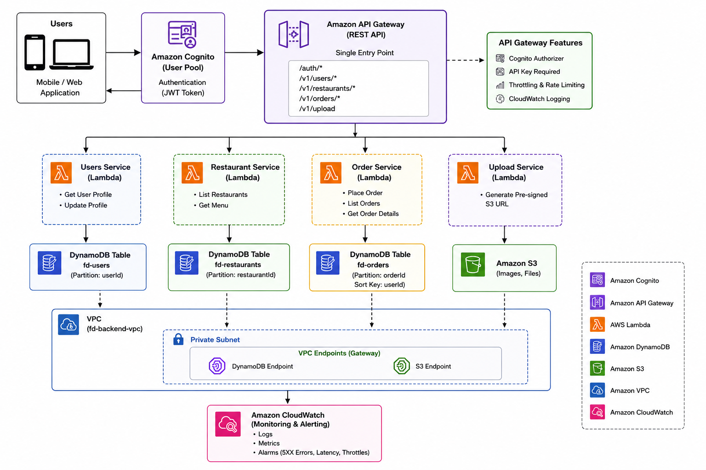

# 🚀 Food Delivery Backend – AWS Serverless Architecture

## 📌 Présentation du projet

Ce projet est un backend complet de livraison de repas conçu avec une architecture **100% serverless sur AWS**.

Il simule un système réel de production utilisé dans les applications modernes de food delivery, avec authentification, gestion des commandes, microservices et monitoring.

---

## 🎯 Objectifs du projet

* Concevoir une architecture cloud scalable et sécurisée
* Implémenter une API REST complète
* Utiliser des services AWS managés
* Mettre en place une authentification JWT
* Structurer un backend en microservices

---

## 🧠 Fonctionnalités principales

* Inscription et authentification des utilisateurs (JWT)
* Gestion des profils utilisateurs
* Navigation des restaurants et menus
* Création et suivi des commandes
* Upload sécurisé d’images via S3
* Monitoring et logs en temps réel
* Sécurisation des API avec API Key + Cognito

---

## 🏗️ Architecture système

Le système repose sur les services AWS suivants :

* Amazon Cognito (authentification)
* Amazon API Gateway (point d’entrée API)
* AWS Lambda (microservices)
* Amazon DynamoDB (base de données NoSQL)
* Amazon S3 (stockage images)
* Amazon CloudWatch (monitoring & logs)
* Amazon VPC (réseau privé)



---

## 🔁 Flux utilisateur

1. L’utilisateur s’inscrit / se connecte via Cognito
2. Il reçoit un token JWT
3. Il interagit avec l’API via API Gateway
4. Les requêtes sont routées vers les Lambda
5. Les données sont stockées dans DynamoDB ou S3
6. CloudWatch surveille les erreurs et performances

---

## 📡 API Endpoints

### Authentification

* POST `/auth/signup`
* POST `/auth/login`

### Utilisateurs

* GET `/v1/users/me`
* PUT `/v1/users/me`

### Restaurants

* GET `/v1/restaurants`
* GET `/v1/restaurants/{id}/menu`

### Commandes

* POST `/v1/orders`
* GET `/v1/orders`
* GET `/v1/orders/{id}`

### Upload

* POST `/v1/upload`

---

## 🔐 Sécurité

* Authentification via JWT (Amazon Cognito)
* Routes protégées par Authorizer
* API Key obligatoire sur endpoints sensibles
* Rate limiting (throttling)
* Infrastructure isolée dans un VPC
* Upload sécurisé via URLs pré-signées S3

---

## 🧪 Tests du projet

Le projet a été testé avec :

* AWS CLI
* PowerShell
* Postman

## 🧱 Structure du projet

```text
food-delivery-backend-aws/
│
├── architecture/
├── lambdas/
└── screenshots/
```

---

## 💼 Impact technique

Ce projet démontre :

* Architecture cloud moderne (serverless)
* Design de microservices
* Sécurisation d’API REST
* Gestion d’authentification JWT
* Observabilité et monitoring
* Bonnes pratiques AWS production

---

## 👨‍💻 Auteur

Bakary Camara
Cloud Computing Student | AWS Enthusiast |

