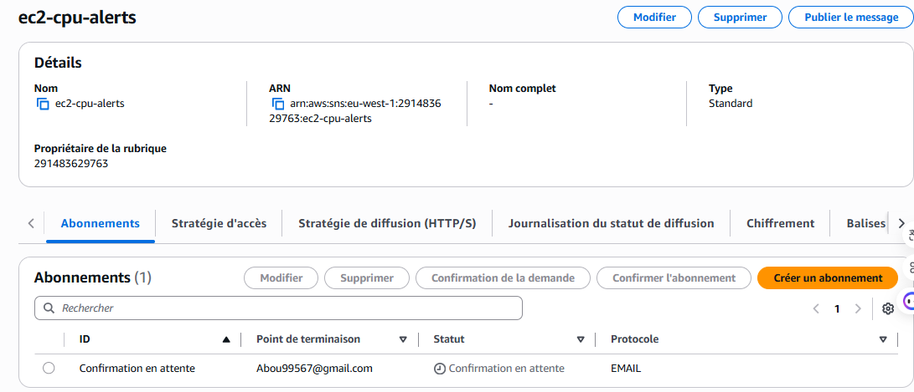
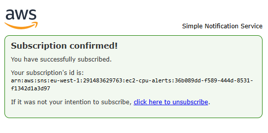
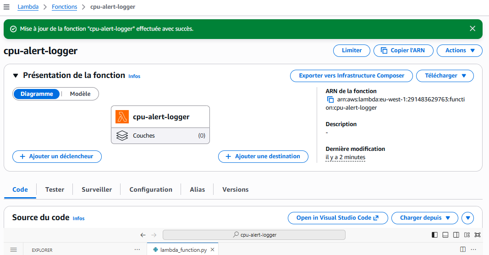
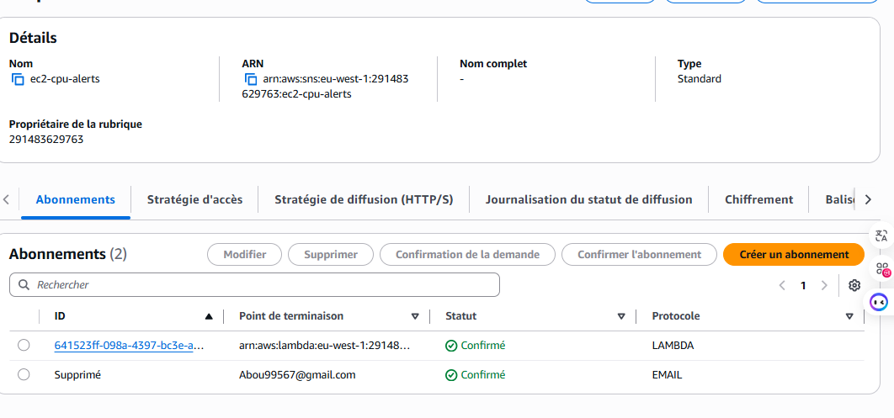
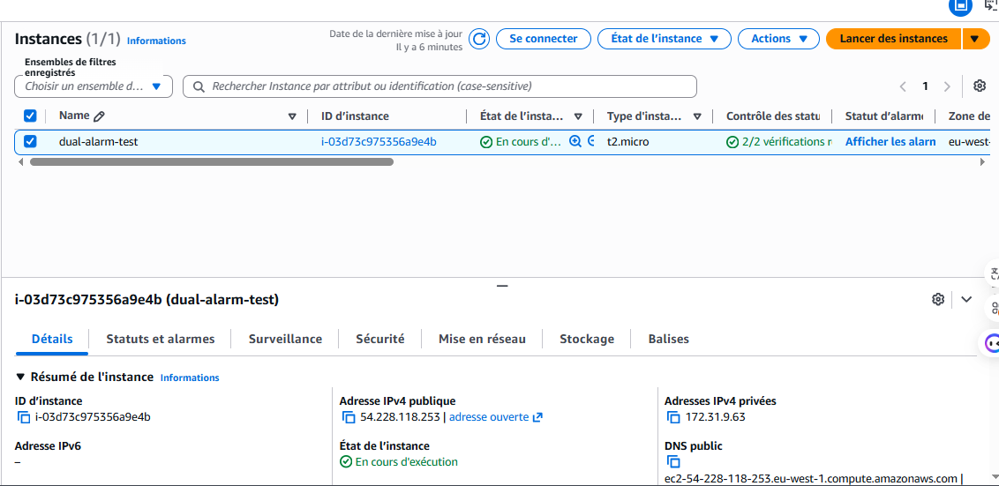
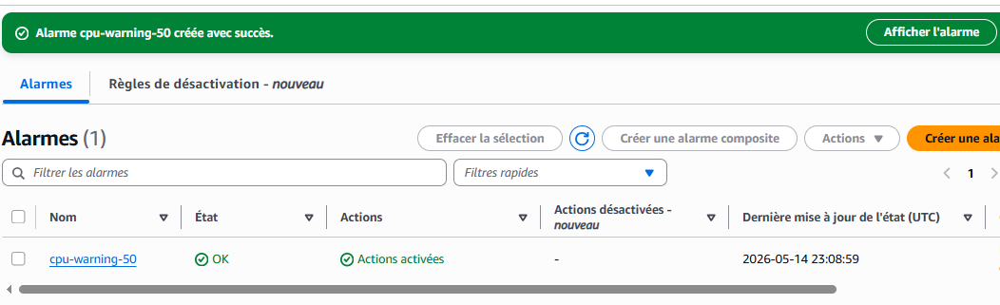
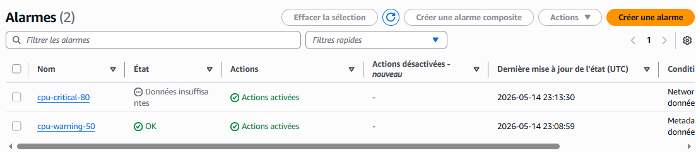
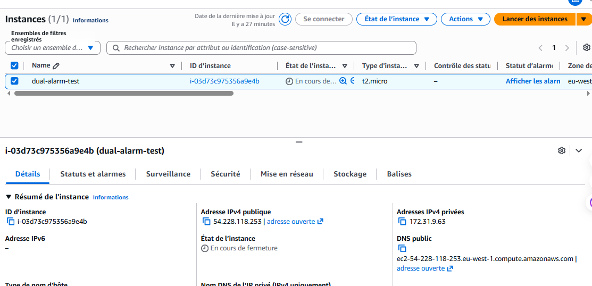

# 🚨 Projet 01 — Doubles Alarmes CloudWatch avec SNS & Automatisation Lambda

## 📌 Présentation du projet

Ce projet démontre comment construire un système AWS de surveillance et de réponse automatisée basé sur une architecture événementielle (Event-Driven Architecture) utilisant :

- Amazon EC2
- Amazon CloudWatch
- Amazon SNS
- AWS Lambda

Le système surveille l’utilisation CPU d’une instance EC2 et réagit différemment selon le niveau critique détecté :

- ⚠️ Seuil d’avertissement → notifications uniquement
- 🔥 Seuil critique → notifications + arrêt automatique de l’instance EC2

Ce projet simule un véritable workflow de monitoring et d’automatisation utilisé dans des environnements cloud professionnels.

---

# 🎯 Objectifs du projet

Les objectifs de ce projet étaient :

- Comprendre le fonctionnement des alarmes CloudWatch
- Configurer plusieurs seuils d’alerte
- Utiliser SNS comme système de diffusion d’événements
- Déclencher automatiquement des fonctions Lambda
- Automatiser des actions EC2
- Comprendre les architectures orientées événements
- Construire un système de monitoring cloud structuré

---

# 🏗️ Architecture

## 📊 Diagramme d’architecture


---

# ⚙️ Services AWS utilisés

| Service AWS | Rôle |
|---|---|
| Amazon EC2 | Simulation de charge CPU |
| Amazon CloudWatch | Surveillance des métriques et création des alarmes |
| Amazon SNS | Distribution des notifications et événements |
| AWS Lambda | Traitement automatique des alertes |
| CloudWatch Logs | Stockage des journaux Lambda |

---

# 🔄 Fonctionnement de l’architecture

```text
Instance EC2
     ↓
Métriques CloudWatch
     ↓
Alarmes CloudWatch
     ↓
Sujet SNS
   ↙     ↘
Email    Lambda
             ↓
      CloudWatch Logs

Alarme critique :
CloudWatch → Arrêt automatique EC2
```

---

# 🚀 Fonctionnalités du projet

## ✅ Alarme d’avertissement (CPU ≥ 50%)

Cette alarme :

- envoie une notification SNS
- déclenche :
  - une notification email
  - une fonction Lambda

---

## ✅ Alarme critique (CPU ≥ 80%)

Cette alarme :

- envoie une notification SNS
- déclenche :
  - une notification email
  - une fonction Lambda
  - l’arrêt automatique de l’instance EC2

---

## ✅ Architecture Fan-Out SNS

Un seul sujet SNS distribue simultanément le même message à plusieurs abonnés :

- Abonné Email
- Abonné Lambda

Cela démontre une architecture découplée basée sur les événements.

---

# 🧪 Scénario de test

Une charge CPU a été simulée avec :

```bash
sudo yum install -y stress
stress --cpu 2 --timeout 300
```

Résultat :

- le CPU dépasse 50 %
- l’alarme warning se déclenche
- le CPU dépasse 80 %
- l’alarme critique se déclenche
- SNS distribue les notifications
- Lambda enregistre l’événement
- l’instance EC2 est arrêtée automatiquement

---

# 🧾 Fonction Lambda

Emplacement :

```text
lambda/cpu-alert-logger.py
```

La fonction Lambda :

- reçoit les messages SNS
- extrait :
  - le sujet
  - le timestamp
  - le message
- écrit des journaux structurés dans CloudWatch Logs

---

# 📂 Structure du projet

```text
project-01-dual-cloudwatch-alarms/
│
├── README.md
│
├── architecture/
│   └── architecture-diagram-pro.png
│
├── screenshots/
│   ├── 01-sns-topic-created.png
│   ├── 02-email-confirmed.png
│   ├── 03-lambda-created.png
│   ├── 04-two-subscriptions.png
│   ├── 05-ec2-running.png
│   ├── 06-warning-alarm-created.png
│   ├── 07-critical-alarm-created.png
│   ├── 08-alarms-ok-state.png
│   └── 09-ec2-stopped.png
│
├── lambda/
│   └── cpu-alert-logger.py
│

```

---

# 📸 Captures d’écran

## Sujet SNS créé



---

## Confirmation de l’abonnement email



---

## Fonction Lambda créée



---

## Abonnements SNS



---

## Instance EC2 en cours d’exécution



---

## Alarme Warning créée



---

## Alarme Critique créée



---

## Alarmes en état OK


---

## Instance EC2 arrêtée automatiquement



---

# 🧠 Concepts clés appris

## Architecture orientée événements

Utilisation de SNS comme système central de diffusion d’événements.

---

## Monitoring Cloud

Utilisation des alarmes CloudWatch pour surveiller une infrastructure AWS.

---

## Automatisation Serverless

Utilisation de Lambda pour traiter automatiquement des événements cloud.

---

## Remédiation automatique

Arrêt automatique d’une instance EC2 lorsqu’un seuil critique est atteint.

---

## Modèle Fan-Out

Un même message SNS envoyé simultanément à plusieurs consommateurs.

---

# 🔥 Concepts professionnels démontrés

- Monitoring & Observabilité
- Automatisation Cloud
- Architectures découplées
- Serverless
- Gestion des alertes
- Réponse automatique aux incidents
- Logging Cloud

---

# ⚠️ Difficultés rencontrées

- Configuration des abonnements SNS
- Compréhension des états CloudWatch
- Gestion des permissions IAM
- Liaison SNS ↔ Lambda
- Configuration des actions EC2 automatiques

---

# ✅ Résultat final

Mise en place réussie d’un pipeline AWS complet capable de :

- détecter des pics CPU
- envoyer des notifications
- traiter automatiquement les alertes
- arrêter automatiquement une instance EC2

---

# 🚀 Améliorations futures

Améliorations possibles :

- notifications Slack
- intégration Auto Scaling
- stockage des audits dans DynamoDB
- monitoring multi-régions
- Infrastructure as Code avec Terraform
- déploiement avec AWS CDK
- dashboards CloudWatch

---

# 👨‍💻 Auteur

## Bakary Camara

Futur AWS Cloud & DevOps Engineer

GitHub :
https://github.com/Aboubacar-tech
