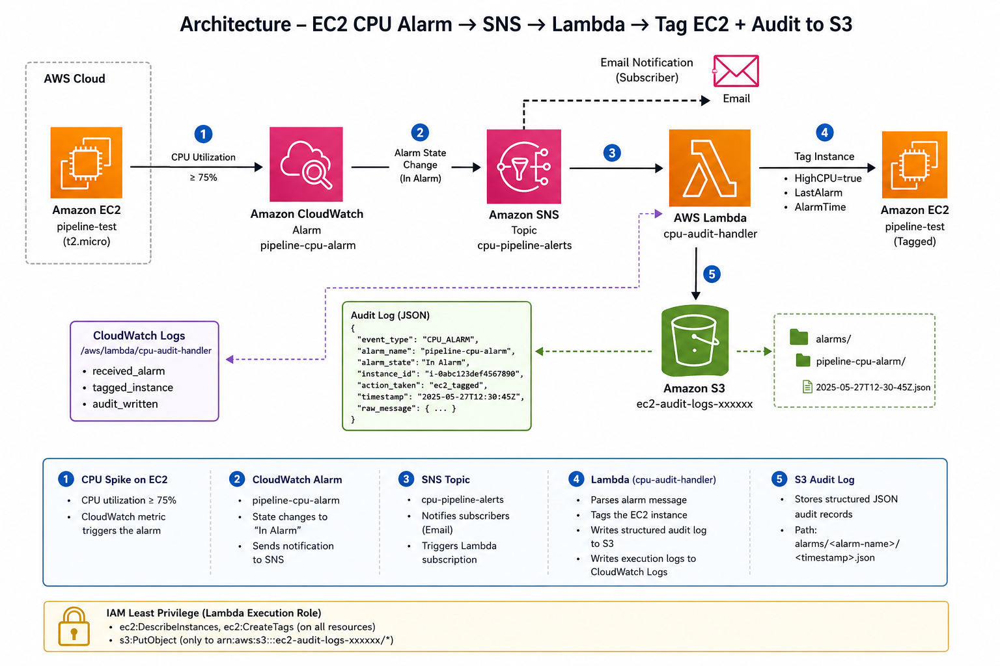

````markdown id="c8x5cw"
# Projet 03 — Pipeline d’audit CPU EC2 avec CloudWatch, SNS, Lambda et S3

## 🏗️ Architecture



Instance EC2  
⬇  
CloudWatch Metrics  
⬇  
CloudWatch Alarm  
⬇  
SNS Topic  
⬇  
Lambda Function  
⬇⬇  
Ajout automatique de tags EC2 + Journalisation d’audit dans S3

---

## 📌 Objectif du projet

Mettre en place un pipeline AWS automatisé capable de :

- surveiller l’utilisation CPU d’une instance EC2
- déclencher une alarme CloudWatch
- envoyer une notification SNS
- exécuter une fonction Lambda
- ajouter automatiquement des tags à l’instance EC2
- générer un journal d’audit structuré dans Amazon S3

---

## ☁️ Services AWS utilisés

- Amazon EC2
- Amazon CloudWatch
- Amazon SNS
- AWS Lambda
- Amazon S3
- AWS IAM

---

## ⚙️ Fonctionnalités

- Surveillance automatique du CPU
- Notifications SNS
- Déclenchement automatique de Lambda
- Ajout automatique de tags EC2
- Journalisation JSON dans S3
- Politique IAM basée sur le moindre privilège

---

## 📂 Structure du projet

```text
project-03-ec2-cpu-audit-pipeline/
├── lambda/
├── iam/
├── scripts/
├── architecture/
├── screenshots/
└── README.md
````

---

## 🧠 Ce que j’ai appris

* Création d’architectures AWS orientées événements
* Automatisation avec CloudWatch, SNS et Lambda
* Journalisation structurée dans S3
* Gestion des permissions IAM
* Surveillance et audit d’instances EC2

---

## 🧪 Test de charge CPU

```bash id="f7yjlwm"
sudo yum install -y stress
stress --cpu 2 --timeout 180
```

Cette commande permet de déclencher l’alarme CloudWatch et de tester tout le pipeline.

---

## 🔐 Sécurité IAM

La fonction Lambda utilise uniquement les permissions nécessaires :

* `ec2:DescribeInstances`
* `ec2:CreateTags`
* `s3:PutObject`

---

## 👨‍💻 Auteur

Aboubacar Camara
Portfolio Cloud Engineering & AWS Projects

```
```
